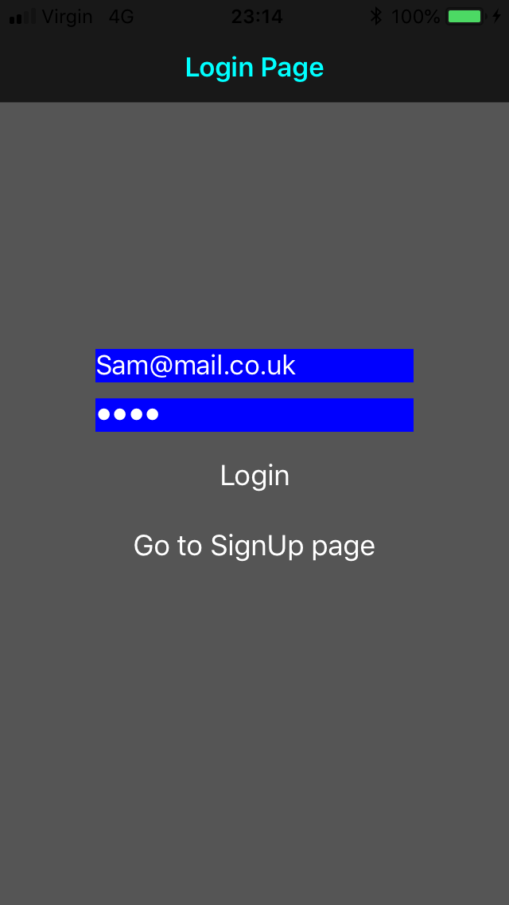
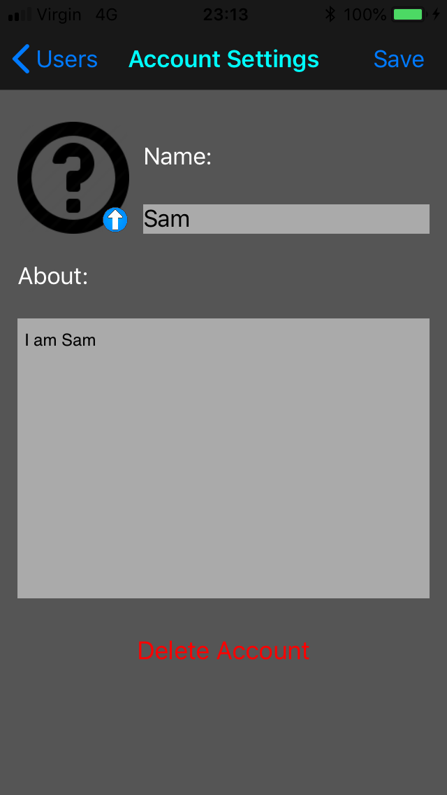
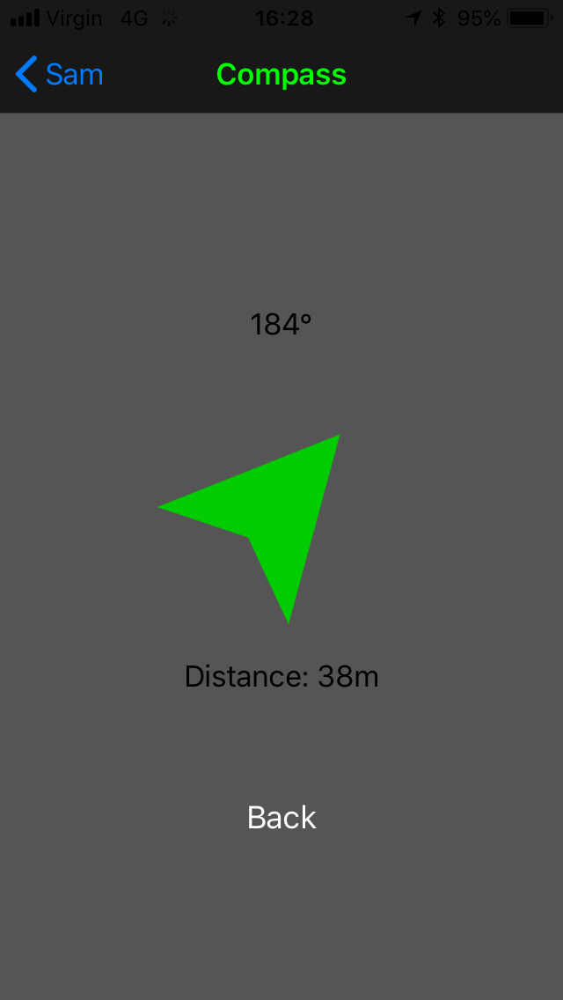
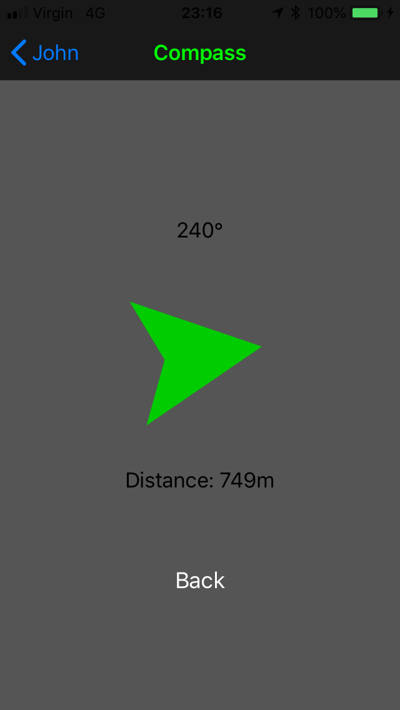
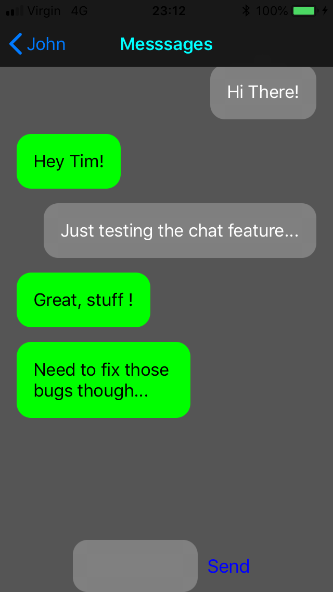

# iOS compass app with some social features📱
## About
An iOS Compass app that can point to custom locations. It uses a Parse Server hosted on AWS to store user data. 
The idea is to find users by location using the compass. I started this project to learn iOS development and swift. 
Be aware this is an incomplete project, therefore the code might appear a bit neglected and the UI is very basic(ugly...) 
I might clean it up or add new features in the future. In the mean-time, I hope you find it interesting or useful.

### Login page and users page
{:height="50%" width="50%"}
-
{:height="50%" width="50%"}

### Account settings and profile page
{:height="50%" width="50%"}
-
{:height="50%" width="50%"}

### Compass 
{:height="50%" width="50%"}
-
{:height="50%" width="50%"}

### Chat
{:height="50%" width="50%"}
_
{:height="50%" width="50%"}
